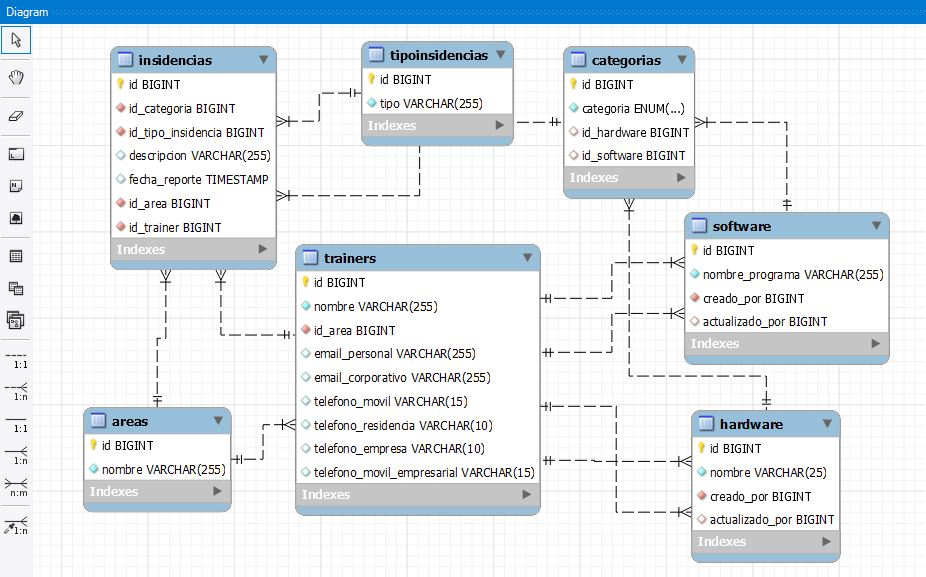

# Insidencias Campuslands

**¿Cómo inicializar el proyecto?**

Se recomienda usar la `v18.16.1` de NojeJS; en el archivo `package.json` se detallan los scripts y las versiones de cada libreria, pero podemons instalar todas las librerias  usando este comando.

````
npm i -E -D class-transformer dotenv express mysql2 nodemon reflect-metadata typescript
````

**Base de datos Relacional **




**Endpoints**

- Hardware

  ````
  http://**HOST**/hardware
  ````

  **GET**

  Devuelve un JSON con los datos de la tabla hardware

  **POST**

  Inserta los datos en formato JSON a la tabla hardware, a continuación se detalla los parámetros principales:

  ````json
  {
      "nombre":"Pepito", // PRINCIPAL Debe contener solo letras/
      "creado_por":4, // PRINCIPAL Debe contener solo numeros/
      " creado_por":4, // OPCIONAL Debe contener solo numeros/
      "actualizado_por":2 // OPCIONAL Debe contener solo numeros/
  }
  ````

- Insidencias

  ````
  http://**HOST**/insidencias
  ````

  **GET**

  Devuelve un JSON con los datos de la tabla hardware

  **POST**

  Inserta los datos en formato JSON a la tabla insidencias, a continuación se detalla los parámetros principales:

  ````json
  {
      " id_categoria":3, // PRINCIPAL Debe contener solo numeros/
      "id_tipo_insidencia":4, // PRINCIPAL Debe contener solo numeros/
      "descripcion":"No sirve una tecla", // OPCIONAL Solo letras/
      "id_area":4, // PRINCIPAL Debe contener solo numeros/
      "id_trainer":2 // PRINCIPAL Debe contener solo numeros/
  }
  ````

  

- Trainers

  **GET**

  Devuelve un JSON con los datos de la tabla trainers

  **POST**

  Inserta los datos en formato JSON a la tabla trainers, a continuación se detalla los parámetros principales:

  ````json
  {
      "nombre":"John", // PRINCIPAL Debe contener solo letras/
      "id_area":4, // PRINCIPAL Debe contener solo numeros/
      "descripcion":"No sirve una tecla", // OPCIONAL Solo letras/
      "telefono_movil":242512, // OPCIONAL Debe contener solo numeros/
      "telefono_residencia":6476217, // OPCIONAL Debe contener solo numeros/
      "telefono_empresa":6478831, // OPCIONAL Debe contener solo numeros/
      "telefono_movil_empresarial":2 // OPCIONAL Debe contener solo numeros/
  }
  ````

  
